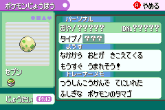

+++
title = 'Alternative Guide to Japanese ACE'
date = 2024-06-26T21:45:27+10:00
+++

## 1. Prerequisites

- Know how to do a single corruption (Glitzer Popping)
- Have the trade Pokemon Dots and Pluses
- All slots from Box 11, Slot 25 must not contain any Pokemon data

## 2. Getting a 0x0615 Egg

Give Dots 21HP/6Atk in EVs, this will allow it to become 0x0615 during corruption. If you want to make the process of counting EVs easier, do not equip Dots with a Macho Brace or let it have Pokerus, they will mess up your EV count.

Perform a single corruption using your favourite method and make sure the Dots is PID corrupted. You can tell if it is PID corrupted if it is in a Nest Ball and it has Pokerus (as seen in the image below):



## 3. Getting 0x085F

Name Boxes 1 to 7 the following:

```text
Box  1: 4 プ U n い 3 ッ o	[4プUnい3ッo]
Box  2: _ _ _ く ッ 8 q _	[   くッ8q ]
Box  3: _ _ ュ ー ッ o _ _	[  ューッo  ]
Box  4: _ そ ッ ゲ n _ _ _	[ そッゲn   ]
Box  5: B ッ O m ‥ 0 O m	[BッOm‥0Om]
Box  6: _ _ _ い ィ ま q ね	[   いィまqね]
Box  7: ぁ m ぅ コ く く _ _	[ぁmぅコくく  ]
```

> ⚠️ **This code will not execute properly on inaccurate emulators (such as VBA)! Make these changes to the box names!**
> 
> - `く` &rarr; `こ` in Box 2
> - `い` &rarr; `_` in Box 6

Then hatch the 0x0615 egg and check Box 10, Slot 19. There should be a glitch Pokemon with species name `あ*` with * representing the new line character. To make sure that we actually have the correct Pokemon, change the name of Box 1 to ` ぶ びぅコくく` and view the summary. If you are brought back to the overworld, you have the correct Pokemon.

## 4. Congratulations

You have 0x085F now, here are some things to know.

You can dispose of 0x0615, the safest way to do it is to place it at the front of the party, enter the PC in deposit mode and release it from there.

You can run codes created by the Japanese glitchers (if you know where to find them), or you can use most of the codes found in Sleipnir17's [Pastebin](https://pastebin.com/u/Sleipnir17).

## Troubleshooting

### I found out the box names are wrong, what to do?

Luckily 0x0615 can be reused but you need to view its summary by viewing another Pokemon's, switching to the statistics page and then switch to 0x0615's page, the code should still execute properly.

### The game crashed! 

If you are on mGBA 0.9.0+ or on console, you have most definitely got the box names (more likely) or the Pokemon wrong. If you are on an inaccurate emulator, double check if you replaced the correct characters then check if you made mistakes elsewhere.

For this case, you most likely made a mistake in Box 6 or Box 7's name.

### I did not get the correct Pokemon

If you are on an inaccurate emulator, check if you have replaced the characters. If not, replace them, then check for mistakes elsewhere.

For this case, you most likely made a mistake in Box 3 or Box 4's name.

### GBARunner2/3

ACE does not work on those hypervisors (as of June 4th 2024), for reasons I do not know.

## Bonus: Generating a stable ARM Pokemon

This code generates 0x6789 in Box 9, Slot 27 which executes the box names in ARM state. Unlike 0x0615, viewing its main summary screen is safe to do and won't crash your game.

```
Box  1: ル ば ぶ ゲ け は い み	[ルばぶゲけはいみ]
Box  2: _ く ミ う ぶ _ l	[ くミうぶ l]
Box  3: ぶ ゥ N ゥ ミ び ち ぃ	[ぶゥNゥミびちぃ]
Box  4: _ グ ヌ _ _ _ _ _	[ グヌ     ]
```
